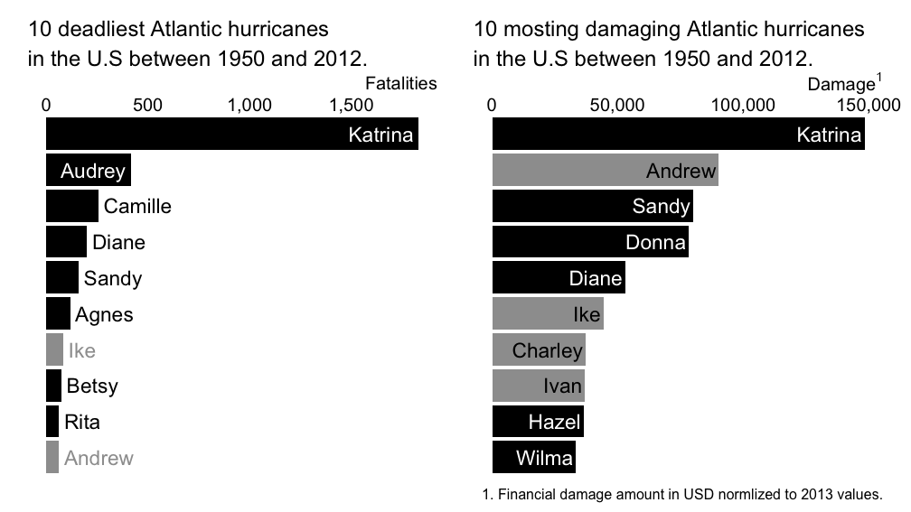
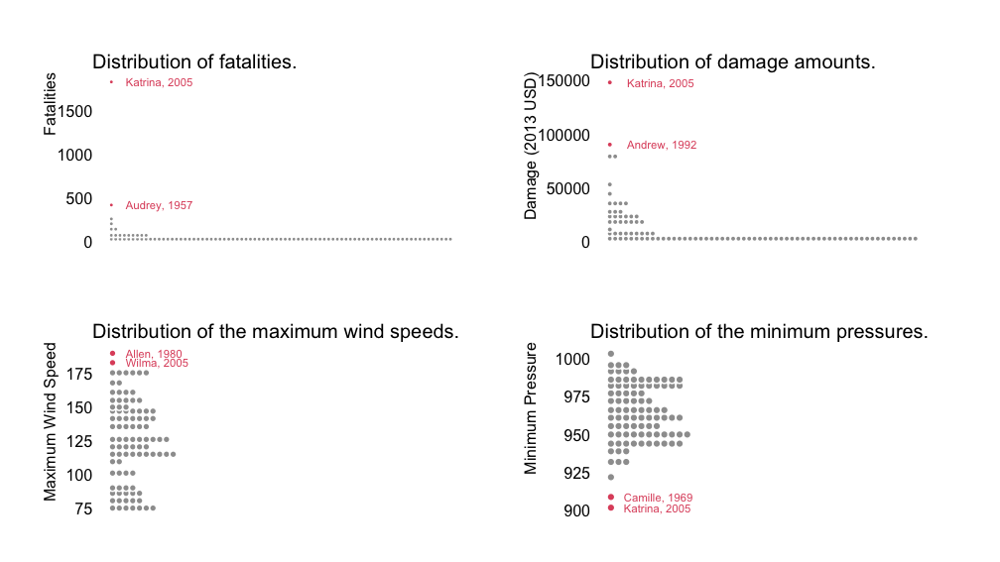
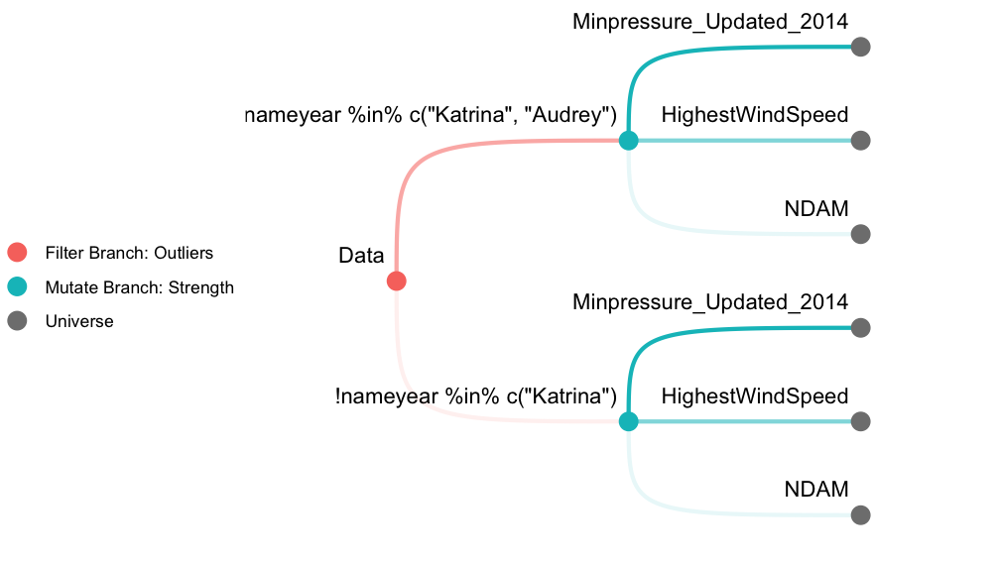
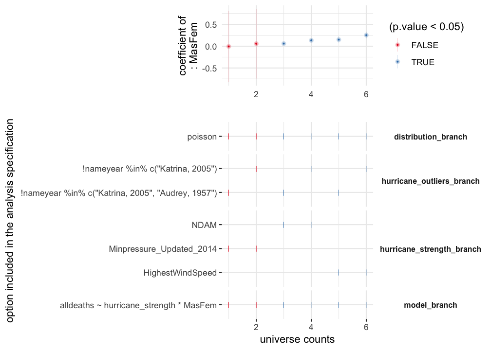

<!-- README.md is generated from README.Rmd. Please edit that file -->

# mverse

<!-- badges: start -->

<!-- badges: end -->

*mverse* is an extension to multiverse package (Sarma et al. 2021) which
allows users create explorable multiverse analysis (Steegen et al. 2016)
in R. This extension provides user friendly abstraction and a set of
examples for researchers, educators, and students in statistics.

## Installation

<!-- You can install the released version of mverse from [CRAN](https://CRAN.R-project.org) with: -->

<!-- ``` r -->

<!-- install.packages("mverse") -->

<!-- ``` -->

You can install the development version from
[GitHub](https://github.com/) with:

``` r
# install.packages("devtools")
devtools::install_github("mverseanalysis/mverse")
```

## Example: Hurricane Names and Gender-based Expectations

This is an example demonstrating a full analysis using `mverse` using
the `hurricane` dataset included in the package. The data set comes from
a study by Jung et al. (2014) and contains the following information
about hurricanes that landed on the U.S. between 1950 and 2021:

  - *MasFem*: Femininity rating on hurricane names (1:very masculine;
    11: very feminine)
  - *alldeaths*: Total fatality counts
  - *NDAM*: Total damage dollar amount normalized to 2013 USD
  - *HighestWindSpeed*: Maximum wind speed
  - *Minpressure\_Updated\_2014*: Minimum pressure
  - *Year*: Year
  - *Name*: Name

Below are the first few lines of the dataset. See `?hurricane` for
details of the dataset.

``` r
library(mverse)
head(hurricane)
#>       Name Year alldeaths  MasFem  NDAM HighestWindSpeed
#> 1     Easy 1950         2 5.40625  2380              125
#> 2     King 1950         4 1.59375  7220              134
#> 3     Able 1952         3 2.96875   210              125
#> 4  Barbara 1953         1 8.62500    78               75
#> 5 Florence 1953         0 7.87500    21              115
#> 6    Carol 1954        60 8.53125 24962              115
#>   Minpressure_Updated_2014 Category MinPressure_before Elapsed.Yrs Source
#> 1                      960        3                958          63    MWR
#> 2                      955        4                955          63    MWR
#> 3                      985        1                985          61    MWR
#> 4                      987        1                987          60    MWR
#> 5                      985        1                985          60    MWR
#> 6                      960        3                960          59    MWR
```

Inspecting the data reveals that 8 of the top 10 hurricanes that caused
most fatalities had female names while only 6 of the top 10 hurricanes
with the most financial damage had female names.



Jung et al. (2014) hypothesized that this gap was due to people
underestimating the severity of a hurricane when it’s named with a
female name. Jung used the data to investigate whether hurricanes with
*feminine* names led to *more fatalities given equal strength* because
their names didn’t motivate as much preparedness as hurricanes with
*masculine* names.

To illustrate a multiverse analysis using `mverse`, we consider a
Poisson regression model that models the relationship between the
femininity of a hurricane’s name and the total fatalities it caused,
while controlling for the strength of the hurricane. We expand the
multiverse based on the following two decision points:

1.  Are there any outliers that we should remove from analysis? If so,
    which ones should we exclude?
2.  Which variable best captures the strength of a hurricane?

In `mverse`, such decision points are called *branches* and the
individual paths we can take at each branch are called *options*. We
list the possible options for the above two branches below.

### Options for Outliers

In order to determine whether we examine the distributions of hurricane
characteristics - fatality counts, financial damage amounts, maximum
wind speed, and minimum pressure.



Upon inspecting the distributions, we may choose to exclude

  - Katrina, 2005 only; or
  - Katrina, 2005 and Audrey, 1957.

### Options for Choosing the Hurricane Strength Variable

To control for the strength of a hurricane, we may use one of

  - Total damage dollar amount normalized to 2013 USD;
  - Maximum wind speed; and
  - Minimum pressure

from the data set.

### Multiverse Analysis in `mverse`

We have 2 options for defining the outliers and 3 options for defining
the hurricane strength. They lead to \(2\times 3=6\) unique analysis
paths, or *universes*, in total as illustrated below.



Below is a short demonstration on how we can perform the multiverse
analysis using `mverse`. See `vignette("hurricane")` for a detailed case
study using the same data.

First, we start by defining a `mverse` object with the dataset used for
the analysis.

``` r
mv <- mverse(hurricane)
```

We then use the `*_branch()` methods to define branches. For defining
the outlier branch, we can use `filter_branch()`.

``` r
hurricane_outliers <- filter_branch(
  ! nameyear %in% c("Katrina, 2005"),
  ! nameyear %in% c("Katrina, 2005", "Audrey, 1957")
)
```

For specifying the hurricane strength variable, we can use
`mutate_branch()`.

``` r
hurricane_strength <- mutate_branch(NDAM, HighestWindSpeed, Minpressure_Updated_2014)
```

We then add the branches to the `mverse` object using
`add_filter_branch()` and `add_mutate_branch()`.

``` r
mv <- mv %>%
  add_filter_branch(hurricane_outliers) %>%
  add_mutate_branch(hurricane_strength)
```

To specify the Poisson regression model, we need the formula and the
probability distribution. We can specify the formula using
`formula_branch()` and the probability distribution using
`family_branch()`. For simplicity, we only consider a single option for
each in this example, but defining multiple options are also possible.

``` r
model <- formula_branch(alldeaths ~ hurricane_strength * MasFem)
distribution <- family_branch(poisson)
```

Similar to the previous branches, we add them to the `mverse` object
using `add_formula_branch()` and `add_family_branch()`.

``` r
mv <- mv %>%
  add_formula_branch(model) %>%
  add_family_branch(distribution)
```

Finally, we fit the generalized linear model by calling `glm_mverse()`.
The method runs R’s `glm` method across the multiverse.

``` r
mv <- mv %>%
  glm_mverse() 
```

### Examining Analysis Results

After completing the analysis, we can extract the results using
`summary()`. The method returns a table with branching options,
estimates, 95% confidence intervals for all regression terms across the
multiverse.

``` r
res <- summary(mv)
head(res)
#> # A tibble: 6 x 12
#>   universe hurricane_outli… hurricane_stren… model_branch distribution_br… term 
#>   <fct>    <fct>            <fct>            <fct>        <fct>            <chr>
#> 1 1        "!nameyear %in%… NDAM             alldeaths ~… poisson          (Int…
#> 2 1        "!nameyear %in%… NDAM             alldeaths ~… poisson          hurr…
#> 3 1        "!nameyear %in%… NDAM             alldeaths ~… poisson          MasF…
#> 4 1        "!nameyear %in%… NDAM             alldeaths ~… poisson          hurr…
#> 5 2        "!nameyear %in%… HighestWindSpeed alldeaths ~… poisson          (Int…
#> 6 2        "!nameyear %in%… HighestWindSpeed alldeaths ~… poisson          hurr…
#> # … with 6 more variables: estimate <dbl>, std.error <dbl>, statistic <dbl>,
#> #   p.value <dbl>, conf.low <dbl>, conf.high <dbl>
```

As the resulting data is in `tibble` format, we can use regular
`tidyverse` grammar to manipulate the data. For example, we can focus on
the estimates on the main effects of femininity across the multiverse.
In the code below, we specifically focus on the estimate and the
confidence intervals.

``` r
library(tidyverse)
res %>%
  filter(term == "MasFem") %>%
  select(hurricane_outliers_branch, hurricane_strength_branch, estimate, conf.low, conf.high)
#> # A tibble: 6 x 5
#>   hurricane_outliers_branch      hurricane_strength… estimate conf.low conf.high
#>   <fct>                          <fct>                  <dbl>    <dbl>     <dbl>
#> 1 "!nameyear %in% c(\"Katrina, … NDAM                 0.134     0.112     0.157 
#> 2 "!nameyear %in% c(\"Katrina, … HighestWindSpeed     0.254     0.177     0.332 
#> 3 "!nameyear %in% c(\"Katrina, … Minpressure_Update…  0.0575   -0.743     0.854 
#> 4 "!nameyear %in% c(\"Katrina, … NDAM                 0.0600    0.0366    0.0839
#> 5 "!nameyear %in% c(\"Katrina, … HighestWindSpeed     0.151     0.0717    0.231 
#> 6 "!nameyear %in% c(\"Katrina, … Minpressure_Update… -0.00504  -0.825     0.811
```

We can also inspect the result graphically using `spec_curve()`. The
method builds a specification curve (Simonsohn et al. 2020) for a term
in the regression model specified by `var`.



The method also allows multiple ways of sorting the estimates. See
`?spec_curve` for details.

## References

<div id="refs" class="references">

<div id="ref-hurricane">

Jung, K., Shavitt, S., Viswanathan, M., and Hilbe, J. M. (2014), “Female
hurricanes are deadlier than male hurricanes,” 111, 8782–8787.
<https://doi.org/10.1073/pnas.1402786111>.

</div>

<div id="ref-multiverseR">

Sarma, A., Kale, A., Moon, M., Taback, N., Chevalier, F., Hullman, J.,
and Kay, M. (2021), “multiverse: Multiplexing Alternative Data Analyses
in R Notebooks (Version 0.5.0).”

</div>

<div id="ref-speccurve">

Simonsohn, U., Simmons, J. P., and Nelson, L. D. (2020), “Specification
curve analsysis,” 4, 1208–1214.
<https://doi.org/10.1038/s41562-020-0912-z>.

</div>

<div id="ref-multiverse">

Steegen, S., Tuerlinckx, F., Gelman, A., and Vanpaemel, W. (2016),
“Increasing transparency through a multiverse analysis,” 11, 702–712.
<https://doi.org/10.1177/1745691616658637>.

</div>

</div>
