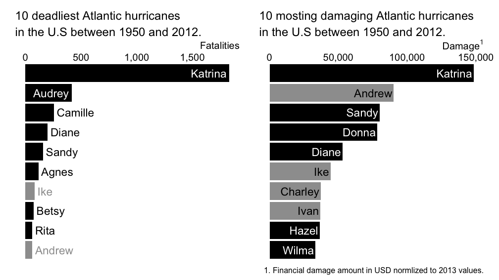
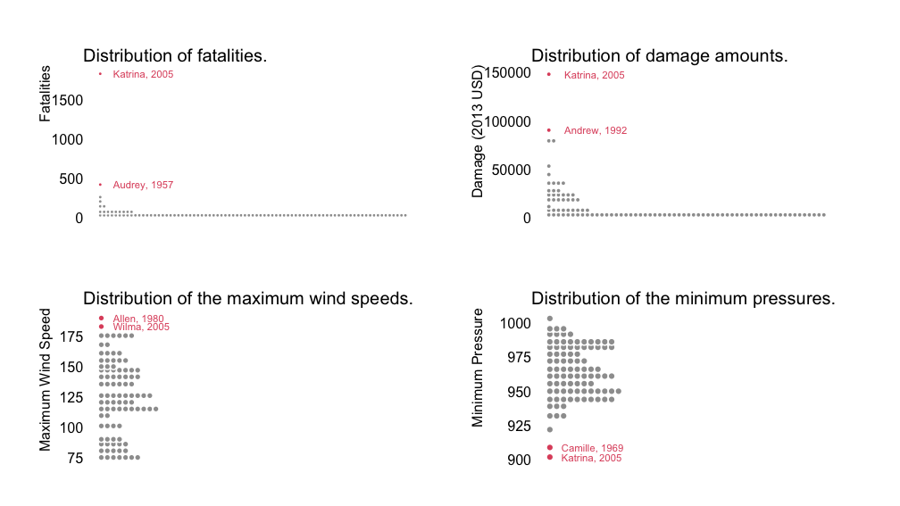
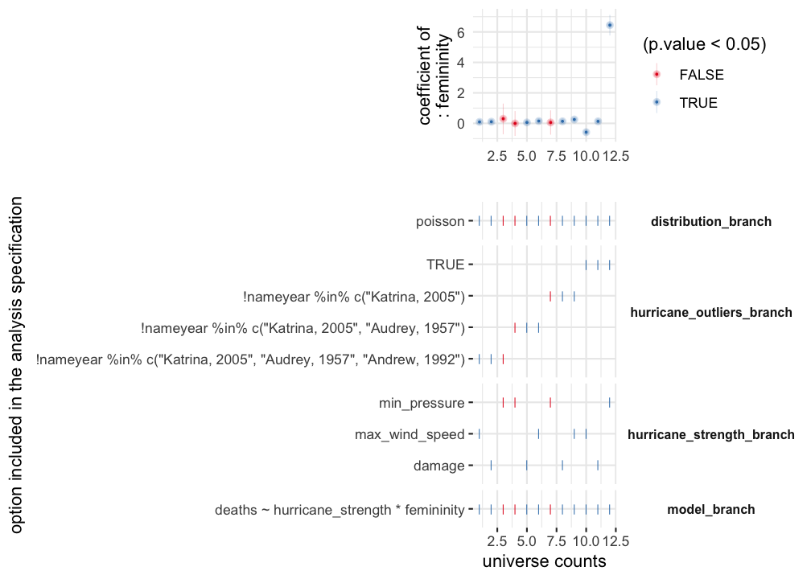
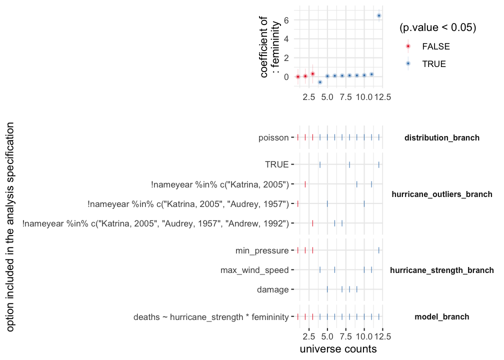

<!-- README.md is generated from README.Rmd. Please edit that file -->

# mverse

<!-- badges: start -->

<!-- badges: end -->

*mverse* is an extension to multiverse package \[1\] which allows users
create explorable multiverse analysis \[2\] in R. This extension
provides user friendly abstraction and a set of examples for
researchers, educators, and students in statistics.

## Installation

<!-- You can install the released version of mverse from [CRAN](https://CRAN.R-project.org) with: -->

<!-- ``` r -->

<!-- install.packages("mverse") -->

<!-- ``` -->

You can install the development version from
[GitHub](https://github.com/) with:

``` r
# install.packages("devtools")
devtools::install_github("mverseanalysis/mverse")
```

## Example: Hurricane Names and Gender-based Expectations

This is an example which demonstrating a full analysis using `mverse`
using the `hurricane` data set included in the package. The data set
comes from a study by Jung et al. \[3\] and contains the following
information about hurricanes that landed on the U.S. between 1950 and
2021:

  - Femininity rating on hurricane names (1:very masculine; 11: very
    feminine)
  - Total fatality counts
  - Total damage dollar amount normalized to 2013 USD
  - Maximum wind speed
  - Minimum pressure
  - Year

<!-- end list -->

``` r
library(mverse)
library(tidyverse)
library(ggplot2)
library(patchwork)
hurricane <- hurricane %>%
  mutate(
    nameyear = paste(Name, Year, sep = ", ") # serves as a unique identifier
  ) %>%
  rename(
    name = Name, # name of the hurricane
    deaths = alldeaths, # total fatality counts
    femininity = MasFem, # femininity rating on hurricane names (1: very masculine; 11: very feminine)
    year = Year, # year the hurricane landed on the U.S.
    min_pressure = Minpressure_Updated_2014, # minimum pressure
    max_wind_speed = HighestWindSpeed, # maximum wind speed
    damage = NDAM, # total damage dollar amount normalized to 2013 USD
  ) %>%
  select(
    name, nameyear, deaths, femininity, year,
    min_pressure, max_wind_speed, damage
  )
head(hurricane)
#>       name       nameyear deaths femininity year min_pressure max_wind_speed
#> 1     Easy     Easy, 1950      2    5.40625 1950          960            125
#> 2     King     King, 1950      4    1.59375 1950          955            134
#> 3     Able     Able, 1952      3    2.96875 1952          985            125
#> 4  Barbara  Barbara, 1953      1    8.62500 1953          987             75
#> 5 Florence Florence, 1953      0    7.87500 1953          985            115
#> 6    Carol    Carol, 1954     60    8.53125 1954          960            115
#>   damage
#> 1   2380
#> 2   7220
#> 3    210
#> 4     78
#> 5     21
#> 6  24962
```



Inspecting the data reveals that 8 of the top 10 hurricanes that caused
most fatalities had female names while only 6 of the top 10 hurricanes
with the most financial damage had female names. Jung \[4\] hypothesized
that this gap was due to people underestimating the severity of a
hurricane when it’s named with a female name. Jung used the data to
investigate whether hurricanes with *feminine* names led to *more
fatalities given equal strength* because their names didn’t motivate as
much preparedness as hurricanes with *masculine* names.

To demonstrate a multiverse analysis using `mverse`, we will consider a
Poisson regression model that models the relationship between the
femininity of a hurricane’s name and the total fatalities it caused,
while controlling for the strength of the hurricane. We will expand the
multiverse based on the following two decision points:

1.  Are there any outliers that we should remove from analysis? If so,
    which ones should we exclude?
2.  Which variable best captures the strength of a hurricane?

### Initiate

We first initiate the multivere analysis by creating a `mverse` object
with the data set. Note that the library assumes a single data set.

``` r
mv <- create_multiverse(hurricane)
# mv <- mverse(hurricane) # alternative method; `mverse` is an alias of `create_multiverse`.
```

### Filter Branch: Branches for Outliers



Upon inspecting the distributions of the fatalities, financial damage
amounts, maximum wind speeds, and minimum pressures, we may choose to
exclude

  - Katrina, 2005 only;
  - Katrina, 2005 and Audrey, 1957;
  - Katrina, 2005, Audrey, 1957, and Andrew, 1992; or
  - none.

We can use `filter_branch` to declare the four options, or branches, of
defining the outliers.

``` r
hurricane_outliers <- filter_branch(
  ! nameyear %in% c("Katrina, 2005"),
  ! nameyear %in% c("Katrina, 2005", "Audrey, 1957"),
  ! nameyear %in% c("Katrina, 2005", "Audrey, 1957", "Andrew, 1992"),
  TRUE # include ALL
)
```

### Mutate Branch: Branches for Defining a Variable

To control for the strength of a hurricane, we may use one of

  - Total damage dollar amount normalized to 2013 USD;
  - Maximum wind speed; and
  - Minimum pressure

from the data set. We can define a new variable `hurricane_strength`
using `mutate_branch` such that we create a multiverse that investigates
all three options.

``` r
hurricane_strength <- mutate_branch(
  damage, max_wind_speed, min_pressure
)
```

### GLM mverse: Fit a GLM Model

To fit a Poisson regression model, we can use `glm_mverse` in the
`mverse` library. `glm_mverse` runs `glm` method across the multiverse.
`glm_mverse` needs to pass the model specification using a formula and
the likelihood family to `glm` in each universe. We can specify the
formula and the family using `formula_branch` and `family_branch`.

``` r
model <- formula_branch(deaths ~ hurricane_strength * femininity)
distribution <- family_branch(poisson)
```

Once we have all branches defined, we can add them to the `mverse`
object using `add_***_branch` methods and fit the model with
`glm_mverse`.

``` r
mv <- mv %>%
  add_filter_branch(hurricane_outliers) %>%
  add_mutate_branch(hurricane_strength) %>%
  add_formula_branch(model) %>%
  add_family_branch(distribution) %>%
  glm_mverse() 
```

### Summary and Specification Curve: Inspect Results

After completing the analysis, we can extract the results using
`summary` method. The method returns a `tibble` with branching options,
estimates, 95% confidence intervals for all regression terms across the
multiverse. Below, we focus on the main effect on *femininity*.

``` r
summary(mv) %>%
  filter(term == "femininity") %>% # inspect the main effect on femininity
  select(hurricane_outliers_branch, hurricane_strength_branch, 
         estimate, p.value, conf.low, conf.high) %>%
  knitr::kable() # for display
```

| hurricane\_outliers\_branch                                        | hurricane\_strength\_branch |    estimate |   p.value |    conf.low |   conf.high |
| :----------------------------------------------------------------- | :-------------------------- | ----------: | --------: | ----------: | ----------: |
| \!nameyear %in% c(“Katrina, 2005”)                                 | damage                      |   0.1343933 | 0.0000000 |   0.1122341 |   0.1570002 |
| \!nameyear %in% c(“Katrina, 2005”)                                 | max\_wind\_speed            |   0.2536985 | 0.0000000 |   0.1773243 |   0.3318985 |
| \!nameyear %in% c(“Katrina, 2005”)                                 | min\_pressure               |   0.0574506 | 0.8878941 | \-0.7433945 |   0.8541447 |
| \!nameyear %in% c(“Katrina, 2005”, “Audrey, 1957”)                 | damage                      |   0.0600460 | 0.0000007 |   0.0365670 |   0.0839252 |
| \!nameyear %in% c(“Katrina, 2005”, “Audrey, 1957”)                 | max\_wind\_speed            |   0.1507707 | 0.0002151 |   0.0717400 |   0.2314930 |
| \!nameyear %in% c(“Katrina, 2005”, “Audrey, 1957”)                 | min\_pressure               | \-0.0050435 | 0.9903569 | \-0.8251576 |   0.8106300 |
| \!nameyear %in% c(“Katrina, 2005”, “Audrey, 1957”, “Andrew, 1992”) | damage                      |   0.1074892 | 0.0000000 |   0.0803540 |   0.1353099 |
| \!nameyear %in% c(“Katrina, 2005”, “Audrey, 1957”, “Andrew, 1992”) | max\_wind\_speed            |   0.0948398 | 0.0214596 |   0.0148483 |   0.1765464 |
| \!nameyear %in% c(“Katrina, 2005”, “Audrey, 1957”, “Andrew, 1992”) | min\_pressure               |   0.3010172 | 0.5583176 | \-0.7169578 |   1.2993413 |
| TRUE                                                               | damage                      |   0.1316251 | 0.0000000 |   0.1103141 |   0.1534216 |
| TRUE                                                               | max\_wind\_speed            | \-0.5792496 | 0.0000000 | \-0.6509088 | \-0.5056369 |
| TRUE                                                               | min\_pressure               |   6.4470376 | 0.0000000 |   5.7668890 |   7.1206032 |

We can also inspect the result graphically using `spec_curve` method.
The method builds a specification curve analysis \[5\] for the specified
term. By default, the universes are sorted by the estimate of interest
specified by `var="femininity"`.

``` r
spec_curve(mv, var = "femininity")
```


The method also allows sorting the universes by whether p-value \< 0.05
or by branch options.

``` r
spec_curve(mv, var = "femininity", branch_order = hurricane_outliers_branch)
```



``` r
spec_curve(mv, var = "femininity", color_order = TRUE)
```



## References

1.  Sarma, A. and Kay, M. *Multiverse: An R package for creating
    multiverse analysis.* 2020.
    <https://mucollective.github.io/multiverse/>

2.  Steegen S, Tuerlinckx F, Gelman A, Vanpaemel W. *Increasing
    Transparency Through a Multiverse Analysis.* Perspect Psychol Sci.
    2016;11(5):702‐712. <doi:10.1177/1745691616658637> URL:
    <https://pubmed.ncbi.nlm.nih.gov/27694465/>

3.  Jung, K., Shavitt, S., Viswanathan, M., and Hilbe, J.M. (2014)
    *Female hurricanes are deadlier than male hurricanes.*  
    Proceedings of the National Academy of Sciences, 111(24), 8782-8787,
    <https://doi.org/10.1073/pnas.1402786111>

4.  Jung, K., Shavitt, S., Viswanathan, M., and Hilbe, J.M. (2014)
    *Female hurricanes are deadlier than male hurricanes.*  
    Proceedings of the National Academy of Sciences, 111(24), 8782-8787,
    <https://doi.org/10.1073/pnas.1402786111>

5.  Simonsohn, U., Simmons, J.P, and Nelson, L.D. (2020) *Specification
    curve analysis.* Nature Human Behaviour, 4, 1208-1214,
    <https://doi.org/10.1038/s41562-020-0912-z>
