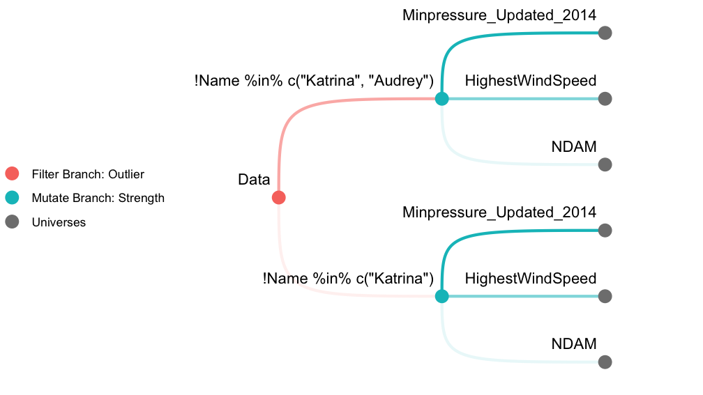

<!-- README.md is generated from README.Rmd. Please edit that file -->

# mverse

<!-- badges: start -->

[](https://github.com/mverseanalysis/mverse/actions)
[](https://app.codecov.io/gh/mverseanalysis/mverse?branch=master)
<!-- badges: end -->

*mverse* is an extension to multiverse package (Sarma et al. 2021) which
allows users create explorable multiverse analysis (Steegen et al. 2016)
in R. This extension provides user friendly abstraction and a set of
examples for researchers, educators, and students in statistics.

## Installation

<!-- You can install the released version of mverse from [CRAN](https://CRAN.R-project.org) with: -->
<!-- ``` r -->
<!-- install.packages("mverse") -->
<!-- ``` -->

You can install the development version from
[GitHub](https://github.com/) with:

``` r
# install.packages("devtools")
devtools::install_github("mverseanalysis/mverse")
```

## Usage

The following demonstration performs a multiverse analysis using
`hurricane` dataset (Jung et al. 2014) included in the library. We first
create 6 universes as described in Figure
<a href="#fig:tree"><strong>??</strong></a>. A filter *branch* with 2
*options* and a mutate *branch* with 3 *options* results in 6
*universes* in total. We then fit a Poisson regression model across the
multiverse and inspect a coefficient estimate. See
`vignette("hurricane")` for a detailed analysis as well as the
terminologies used.



### Initiate

First, we start by loading the library and defining a `mverse` object
with the dataset of interest.

``` r
library(mverse)
mv <- mverse(hurricane)
```

### Define Branches

We use the `*_branch()` methods to define branches. `filter_branch()`
defines filtering operations using `dplyr::filter()` with different
options for the filter.

``` r
outliers <- filter_branch(
  ! Name %in% c("Katrina"),
  ! Name %in% c("Katrina", "Audrey")
)
```

`mutate_branch()` multiplexes `dplyr::mutate()` to add a new column in
the dataset.

``` r
strength <- mutate_branch(
  NDAM, HighestWindSpeed, Minpressure_Updated_2014)
```

In order to fit a Poisson regression, we need to specify the model using
R’s formula syntax and the underlying distribution using `family`. In
`mverse`, we provide the specifications using `formula_branch()` and
`family_branch()`. In this demonstration, we only define a single option
for both formula and family but it is possible to provide multiple
options for them as well.

``` r
model <- formula_branch(alldeaths ~ strength * MasFem)
distribution <- family_branch(poisson)
```

### Add Branches

After defining the branches, we can add the branch objects to the
`mverse` object using `add_*_branch()` methods.

``` r
mv <- mv %>%
  add_filter_branch(outliers) %>%
  add_mutate_branch(strength) %>%
  add_formula_branch(model) %>%
  add_family_branch(distribution)
```

### Fit Model

`glm_mverse()` multiplexes `stats::glm()` function and fits a GLM in
each universe according to the specifications provided by
`add_fomula_branch()` and `add_family_branch()`.

``` r
mv <- mv %>% glm_mverse()
```

### Extract Results

After completing the analysis, we can extract the results using
`summary()`. The method returns a table with branching options,
estimates, 95% confidence intervals for all regression terms across the
multiverse.

``` r
res <- summary(mv)
res
#> # A tibble: 24 × 12
#>    universe outliers_branch  strength_branch model_branch distribution_br… term 
#>    <fct>    <fct>            <fct>           <fct>        <fct>            <chr>
#>  1 1        "!Name %in% c(\… NDAM            alldeaths ~… poisson          (Int…
#>  2 1        "!Name %in% c(\… NDAM            alldeaths ~… poisson          stre…
#>  3 1        "!Name %in% c(\… NDAM            alldeaths ~… poisson          MasF…
#>  4 1        "!Name %in% c(\… NDAM            alldeaths ~… poisson          stre…
#>  5 2        "!Name %in% c(\… HighestWindSpe… alldeaths ~… poisson          (Int…
#>  6 2        "!Name %in% c(\… HighestWindSpe… alldeaths ~… poisson          stre…
#>  7 2        "!Name %in% c(\… HighestWindSpe… alldeaths ~… poisson          MasF…
#>  8 2        "!Name %in% c(\… HighestWindSpe… alldeaths ~… poisson          stre…
#>  9 3        "!Name %in% c(\… Minpressure_Up… alldeaths ~… poisson          (Int…
#> 10 3        "!Name %in% c(\… Minpressure_Up… alldeaths ~… poisson          stre…
#> # … with 14 more rows, and 6 more variables: estimate <dbl>, std.error <dbl>,
#> #   statistic <dbl>, p.value <dbl>, conf.low <dbl>, conf.high <dbl>
```

The resulting data is a `tibble` object and we can use regular
`tidyverse` grammar to manipulate the data. In the code below, we
specifically focus on the estimated coefficient for `MasFem` and its
confidence intervals.

``` r
library(tidyverse)
res %>%
  filter(term == "MasFem") %>%
  select(outliers_branch, strength_branch, term, estimate, conf.low, conf.high)
#> # A tibble: 6 × 6
#>   outliers_branch              strength_branch term  estimate conf.low conf.high
#>   <fct>                        <fct>           <chr>    <dbl>    <dbl>     <dbl>
#> 1 "!Name %in% c(\"Katrina\")"  NDAM            MasF…  0.134     0.112     0.157 
#> 2 "!Name %in% c(\"Katrina\")"  HighestWindSpe… MasF…  0.254     0.177     0.332 
#> 3 "!Name %in% c(\"Katrina\")"  Minpressure_Up… MasF…  0.0575   -0.743     0.854 
#> 4 "!Name %in% c(\"Katrina\", … NDAM            MasF…  0.0600    0.0366    0.0839
#> 5 "!Name %in% c(\"Katrina\", … HighestWindSpe… MasF…  0.151     0.0717    0.231 
#> 6 "!Name %in% c(\"Katrina\", … Minpressure_Up… MasF… -0.00504  -0.825     0.811
```

### Plot a Specification Curve

We can also inspect the result graphically using `spec_curve()`. The
method builds a specification curve (Simonsohn, Simmons, and Nelson
2020) for a term in the regression model specified by `var`. The method
also allows multiple ways of sorting the estimates. See `?spec_curve`
for details.

``` r
spec_curve(mv, var = "MasFem")
```


## References

<div id="refs" class="references csl-bib-body hanging-indent">

<div id="ref-hurricane" class="csl-entry">

Jung, Kiju, Sharon Shavitt, Madhu Viswanathan, and Joseph M. Hilbe.
2014. “Female Hurricanes Are Deadlier Than Male Hurricanes” 111 (24):
8782–87. <https://doi.org/10.1073/pnas.1402786111>.

</div>

<div id="ref-multiverseR" class="csl-entry">

Sarma, Abhraneel, Alex Kale, Michael Moon, Nathan Taback, Fanny
Chevalier, Jessica Hullman, and Matthew Kay. 2021. “Multiverse:
Multiplexing Alternative Data Analyses in R Notebooks (Version 0.5.0).”
<https://github.com/MUCollective/multiverse>.

</div>

<div id="ref-speccurve" class="csl-entry">

Simonsohn, Uri, Joseph P. Simmons, and Leif D. Nelson. 2020.
“Specification Curve Analsysis” 4 (July): 1208–14.
<https://doi.org/10.1038/s41562-020-0912-z>.

</div>

<div id="ref-multiverse" class="csl-entry">

Steegen, Sara, Francis Tuerlinckx, Andrew Gelman, and Wolf Vanpaemel.
2016. “Increasing Transparency Through a Multiverse Analysis” 11 (5):
702–12. <https://doi.org/10.1177/1745691616658637>.

</div>

</div>
